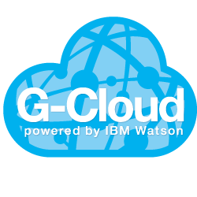

[Hamburg](https://github.com/IBM-Hackathon/Hamburg2016/wiki) > [Howto](https://github.com/IBM-Hackathon/Hamburg2016/wiki/Howto) > [Cognitive APIs on IBM G-Cloud](https://github.com/IBM-Hackathon/cognitive-apis) > Getting started

# Getting started with Cognitive APIs on IBM G-Cloud

Your application must have authorization credentials to be able to use the Cognitive APIs. Those credentials need to be send in the HTTP header of each request to the API to identify the application and provide access.

The following sections guide you to obtain those credentials.

## Prerequisites

To be able to login to the Cognitive APIs Developer Portal a valid IBM ID is required. This should be the same one as you use to login to IBM Bluemix.

If you don't have one, sign up on [ibm.com](https://www.ibm.com/account/us-en/signup/register.html).

## Create an account on the Developer Portal

Goto the [Cognitive API's Developer Portal](https://cognitive-apis-g-cloud-dev.developer.eu.apiconnect.ibmcloud.com/).

On the top right corner select `Login` to login with your IBM ID.

After your first login with an IBM ID the portal will ask for your Developer Organization's name. This can be your company name, the name of your university or any other name.

## Obtain authorization credentials

In the Developer Portal select `Apps` from the main menu and then select `Register new App` on the upcoming page.

Enter a title for your application and submit the form.

In the upcoming screen the Developer Portal shows your Client-Key and Client-Secret. Take a note of both keys - The Client Secret which is displayed in the green box in the top will only be shown once to you. You'll need the keys later when requesting the API.

## Subscribe APIs

After you've created an application you can subscribe it to the [Cognitive APIs](https://cognitive-apis-g-cloud-dev.developer.eu.apiconnect.ibmcloud.com/node/115). To do so, select `API Products` from the Developer Portal's main menu. Then select `gcloud-services 1.0.2` from the list of API products.

Finally subscribe to the `IBM Hackathon 2016 - Hamburg` plan by clicking the 'Subscribe' button and selecting your application in the upcoming popup dialog.

Your application is now entitled to use the APIs with a maximum of 5 requests/ minute.

See [How to use Cognitive APIs](./howto.md) guide to see how the APIs are used.
